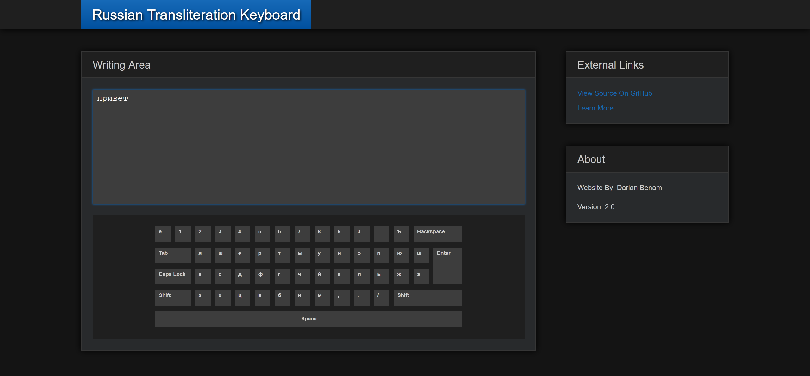
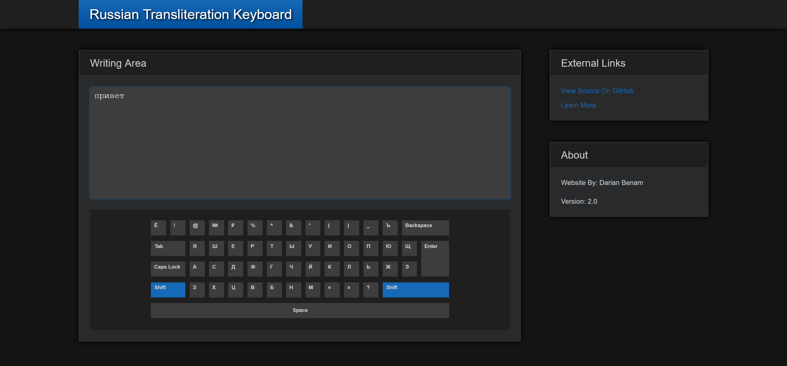

# Russian-Transliteration-Keyboard
Привет!

This is an English to Russian transliteration app made using HTML, CSS, and JavaScript. Transliteration is the method of representing letters or words of one alphabet in the characters of another alphabet or script.

## Screenshots

